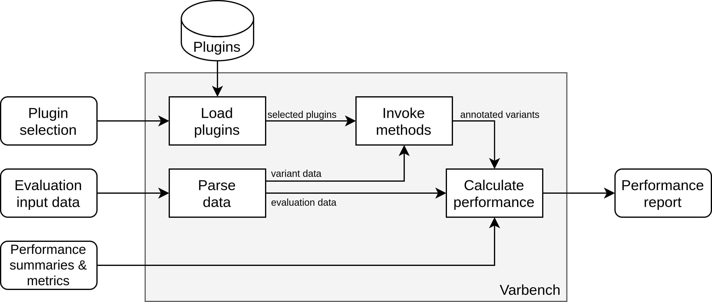

.. _concepts:

Core Concepts
=============

The overall architecture of VPMBench assembles a pipeline in which the variant prioritization methods are integrated as plugins:

.. _pipeline-overview:

   Overview of the VPMbench architecture.

To use VPMBench you have to specify the following inputs:

* Plugin selection: A boolean function returning true for each plugin that should be executed.
* Evaluation input data: Your dataset based on which the performance summaries and metrics shall be computed.
* Performance summaries and metrics: The performance summaries and metrics that should be calculated for the prioritization methods.

Using your inputs VPMBench automatically

* parses your evaluation input data into an internal representation,
* uses the plugin selection function to load and filter the plugins,
* invokes the prioritization methods, and
* calculates the specified performance summaries and metrics.

As a result, you will get a dictionary containing the calculated summaries and metrics for each plugin.
You can then further process the results or do whatever you want with them.

------------------

Evaluation input data
---------------------

The evaluation input data is data you want to use to evaluate the performance of the prioritization methods.
To use this data in our pipeline, we use an :class:`Extractor <vpmbench.extractor.Extractor>` to :func:`extract <vpmbench.api.extract_evaluation_data>` the information about the variants from your data.
The extracted information is represented as :class:`EvaluationData <vpmbench.data.Evaluation>` in our pipeline.

To ensure that VPMBench can use your evaluation input data, the Extractor has to extract the following information about the variants from your data:

.. table::
    :widths: auto

    +-------------------+-------+------------------------------------------------------------+
    | Attribute         | Name  | Description                                                |
    +===================+=======+============================================================+
    | Chromosome        | CHROM | The chromosome in which the variant is found.              |
    +-------------------+-------+------------------------------------------------------------+
    | Position          | POS   | The 1-based position of the variant within the chromosome. |
    +-------------------+-------+------------------------------------------------------------+
    | Reference         | REF   | The reference bases.                                       |
    +-------------------+-------+------------------------------------------------------------+
    | Alternative       | ALT   | The alternative bases.                                     |
    +-------------------+-------+------------------------------------------------------------+
    | Reference Genome  | RG    | The reference genome is used to call the variant.          |
    +-------------------+-------+------------------------------------------------------------+
    | Variation type    | TYPE  | The variation type of the variant.                         |
    +-------------------+-------+------------------------------------------------------------+
    | Classification    | CLASS | The expected classification of the variant.                |
    +-------------------+-------+------------------------------------------------------------+

Additionally, we also add a UID attribute to the data assigning each variant a unique numerical identifier.
This attribute allows us to reference the variant in the later steps of the pipeline.

Finally, we validate the resulting EvaluationData to ensure the compatibility of the data with the rest of our pipeline.
Therefore, the data has to satisfy the following constraints:

* CHROM has to be a string and has to be in the set :math:`\{1,..,22,X,Y\}`
* REF has to be a string consisting of the letters A, C, G, T, N
* ALT has to be a string consisting of the letters A, C, G, T, N,*
* RG has to be one of :class:`vpmbench.enums.ReferenceGenome`
* TYPE has to be one of :class:`vpmbench.enums.VariationType`
* CLASS has to be a string

Currently, we provide an extractor for:

    * ClinVar-VCF files (:class:`ClinVarVCFExtractor <vpmbench.extractor.ClinVarVCFExtractor>`)
    * VariSNP Benchmarksuite files (:class:`VariSNPExtractor <vpmbench.extractor.VariSNPExtractor>`)

If you want to develop your extractor for your custom format, your Extractor class has to inherit from original :class:`Extractor <vpmbench.extractor.Extractor>` class.
If you want develop an custom extractor based on the CSV or VCF format, you can inherit from and implement the corresponding interfaces from :class:`CSVExtractor <vpmbench.extractor.CSVExtractor>` or :class:`VCFExtractor <vpmbench.extractor.VCFExtractor>`. Examples for such custom extractors can be found under ``tests/test_extractors.py``.

In general, we recommend you to build a list of :class:`EvaluationDataEntries <vpmbench.data.EvaluationDataEntry>` in your extractor and pass them to :meth:`vpmbench.data.EvaluationData.from_records` to create the EvaluationData.
This will also handle the assigning of the UID for you.
Also, you can use :meth:`ReferenceGenome.resolve() <vpmbench.enums.ReferenceGenome.resolve>`, :meth:`VariationType.resolve() <vpmbench.enums.VariationType.resolve>`, and :meth:`PathogencityClass.resolve() <vpmbench.enums.PathogencityClass.resolve>` helping you to create valid attributes.

---------

Plugins
-------
.. _plugins:

In VPMBench, we integrate the variant prioritization methods as plugins into our pipeline.
This allows you to integrate new methods, may they existing ones or your method under development, into VPMBench without changing pipeline code.

To integrate the methods, you have to

    1. develop a plugin, and
    2. copy the directory of all the files required for your plugin into your plugin directory (default: :mod:`~/VPMBench-Plugins <vpmbench.config>`) so that each plugin has its subdirectory.

Thus, a look in your plugin directory might look like this:

.. code-block:: console

    $ ls ~/VPMBench-Plugins
    cadd fathmm

If you want to develop a new plugin, you have to create :ref:`manifest file<manifest>` and develop the custom processing logic which is used by VPMBench to invoke the method.

Manifest files
^^^^^^^^^^^^^^
.. _manifest:

The manifest files have to be saved under the name ``manifest.yaml``.
Within the manifest files, you have to specify  :ref:`meta-information <meta_information>` about the prioritization method, e.g., the name, version, and supported variation types, and an entry point for VPMBench to invoke the method.
This has to be done using `YAML <https://gettaurus.org/docs/YAMLTutorial/>`_.
VPMBench then automatically discovers your plugins by recursively searching for ``manifest.yaml`` files in your plugin directory.
The found manifests are parsed and processed by the :class:`PluginBuilder <vpmbench.plugin.PluginBuilder>` to get :class:`Plugin <vpmbench.plugin.Plugin>` objects.

----------------

.. _meta_information:

The following tables give an overview of the meta-information, you can specify in the manifest:

.. table::
    :widths: auto

    +----------------------+-----------------------------------------------------------+----------+
    | Attribute            | Description                                               | Required |
    +======================+===========================================================+==========+
    | name                 | The name of the method                                    | Yes      |
    +----------------------+-----------------------------------------------------------+----------+
    | version              | The release version                                       | No       |
    +----------------------+-----------------------------------------------------------+----------+
    | supported-variations | A list of supported variation types                       | Yes      |
    +----------------------+-----------------------------------------------------------+----------+
    | reference-genomes    | A list of supported reference genomes                     | Yes      |
    +----------------------+-----------------------------------------------------------+----------+
    | cutoff               | A numerical cutoff to interpret the scores (default: 0.5) | No       |
    +----------------------+-----------------------------------------------------------+----------+
    | databases            | A list of accompanying databases and their versions       | No       |
    +----------------------+-----------------------------------------------------------+----------+

The expected types for the attributes are

    * name: String
    * version: String
    * supported-variations: List of Strings; Each element is automatically resolved by :meth:`VariationType.resolve <vpmbench.enums.VariationType.resolve>`.
    * reference-genomes: List of Strings; Each element is automatically resolved by :meth:`ReferenceGenome.resolve <vpmbench.enums.ReferenceGenome.resolve>`.
    * cutoff: float
    * databases: List of key-value pairs; Key = Name of the Database, Value = Version of the Database

An example for the specification of the meta-information might look like this:

.. code-block:: yaml

    name: fathmm-MKL (non-coding)
    version: 2017_02_03_GITHUB
    supported-variants: SNP
    reference-genome: GRCh37/hg19
    cutoff: 0.5
    databases:
        - fathmm-MKL_Current.tab.gz: 2014_09_12

----------------

Python Plugins
^^^^^^^^^^^^^^

In a Python plugin, you can implement the custom processing logic using Python.
Therefore, VPMBench automatically loads your custom processing logic by using the information from the ``entry-point`` attribute of your manifest file.
Thus, you need to make sure that the libraries you use are also available for VPMBench.
As established variant prioritization methods are often come with a bunch of different scripts or even requiring conflicting software versions, e.g., Python 2 vs. Python3, we recommend only use Python Plugin to evaluate the performance of methods under development.

A specification for a Python file as the entry point requires the following information:

+-----------+-----------------------------------------------------------------------+----------+
| Attribute | Description                                                           | Required |
+===========+=======================================================================+==========+
| mode      | Has to be "Python" for Python entrypoint                              | yes      |
+-----------+-----------------------------------------------------------------------+----------+
| file      | The file containing the implementation of the custom processing logic | yes      |
+-----------+-----------------------------------------------------------------------+----------+

The expected types for the attributes are

    * mode: String
    * file: String; File path has to be relative to the manifest file.

An example for the specification of a Python entry point looks like this:

.. code-block:: yaml

    entry-point:
          mode: Python
          file: ./entrypoint.py

In the specified file, you have to implement the custom processing logic to invoke your method.
Therefore, you have to implement an ``entry_point``-function which called by VPMBench with the :attr:`variant data <vpmbench.data.EvaluationData.variant_data>` from your parsed EvaluationData.

.. code-block:: python

    from pandas import DataFrame

    def entry_point(arg):
        result = DataFrame(arg["UID"])
        result["SCORE"] = 0
        return result

--------

Docker Plugin
^^^^^^^^^^^^^

Using a Docker plugin, you can implement the custom processing logic using any programming language you want.
Moreover, Docker also prevents conflicts between the different software stacks of the prioritization methods.
Thus, we recommend Docker plugins to integrate established variant prioritization methods, e.g., CADD or fathmm-MKL, into VPMBench.

A Docker plugin is executed by

    1. converting the :class:`EvaluationData <vpmbench.data.Evaluation>` into the expected input format for the method,
    2. starting a Docker container for the method and execute a specified run-command, and
    3. parsing the output file.

.. warning::
    We do not support building the Docker images for the Docker containers.
    You have to build the Docker images before using them in a plugin.

-------------

To ensure the compatibility of the Docker Plugin with our testbench, we rely on the following specification for the entry point:

+-----------+------------------------------------------------------------------------------------+----------+
| Attribute | Description                                                                        | Required |
+===========+====================================================================================+==========+
| mode      | Has to be "Docker" for a Docker entrypoint.                                        | yes      |
+-----------+------------------------------------------------------------------------------------+----------+
| image     | Name of the Docker image containing the custom processing logic.                   | yes      |
+-----------+------------------------------------------------------------------------------------+----------+
| input     | The file-path and the format for the input data.                                   | yes      |
+-----------+------------------------------------------------------------------------------------+----------+
| output    | The file-path and the format for the out data.                                     | yes      |
+-----------+------------------------------------------------------------------------------------+----------+
| bindings  | Additional bindings for the Docker entry point relative to the manifest.           | no       |
+-----------+------------------------------------------------------------------------------------+----------+
| run       | The run command for the Docker container to start the processing logic.            | yes      |
+-----------+------------------------------------------------------------------------------------+----------+

The expected types for the attributes are
    * mode: String
    * image: String
    * input: Dictionary with the keys
        * ``format`` specifies the expected input format of the method
        * ``file-path`` describes where the input file should be mounted in the Docker container
        * ``args`` to pass additional information to the converter function
    * output: Dictionary
        * ``format`` describes the output format of the method
        * ``file-path`` describes where the output file should be mounted in the Docker container
        * ``args`` to pass additional information to the converter function
    * bindings: Dictionary; The keys are the file paths relative to the manifest file. The values are the file paths where the file should be mounted in the Docker container.
    * run: String

Using the ``format``, we automatically load the corresponding converter function for the :func:`input <vpmbench.processors.format_input>` and the :func:`output <vpmbench.processors.format_output>`.
The input converter converts the :attr:`variant data <vpmbench.data.EvaluationData.variant_data>` and writes the result to file which is mounted in the Docker container under the respective ``file-path`` of the input data.
The output converter reads the results from the output file under its respective ``file-path`` and passes the result to the next steps in our pipeline.

An example for the specification of a Docker entry point looks like this:

.. code-block:: yaml

    entry-point:
      mode: Docker
      image: vpmbench/fathmm-non-coding
      input:
        file-path: /input.csv
        format: CSV
        args:
          header: False
      output:
        file-path: /output.csv
        format: CSV
      bindings:
        ../fathmm-MKL_Current.tab.gz: /fathmm-MKL/fathmm-MKL_Current.tab.gz
        ../fathmm-MKL_Current.tab.gz.tbi: /fathmm-MKL/fathmm-MKL_Current.tab.gz.tbi
      run: ./wrapper.sh /input.csv /output.csv

In the run command, you can specify any command which can be executed within the Docker container.
We recommend writing a short wrapper script that uses the input and output files as input and internally invokes the method and processes the data into the expected output format.

An example for a wrapper script might look like this:

.. code-block:: bash

    #!/usr/bin/env bash

    python2 /fathmm-MKL/fathmm-MKL.py $1 /fathmm-result.tsv /fathmm-MKL/fathmm-MKL_Current.tab.gz
    cat /fathmm-result.tsv | awk -F '\t' 'NR==1{print "CHROM,POS,REF,ALT,SCORE"} NR>1{printf("%s,%s,%s,%s,%s\n",$1,$2,$3,$4,$5)}' > $2

------------------------------

Plugin Selection
----------------

The plugin selection has to be a boolean function accepting a :class:`Plugin <vpmbench.plugin.Plugin>` as input.
Depending on the output of the function the following happens:

* ``True``: The plugin is executed in our pipeline.
* ``False`` The plugin is not executed in our pipeline.

Examples for plugin selection functions are shown in the following code block:

.. code-block:: python

    # Run all plugins
    lambda plugin: True

    # Run only fathmm-MKL (non-coding)
    lambda plugin: plugin.name == "fathmm-MKL (non-coding)"

    # Run all variant prioritization methods supporting INDELs
    lambda plugin: "INDEL" in plugin.supported_variants

To help you specify the selection function, you can also call :func:`load_plugins <vpmbench.api.load_plugins>` before running the pipeline to get an overview of the available plugins.

-------------------------------------

Performance Report
------------------

After :func:`running the pipeline <vpmbench.api.run_pipeline>`, we pass a :class:`performance report <vpmbench.data.PerformanceReport>` back to you.
The performance report consists of the calculated performance summaries and metrics, the plugins evaluated, and a data frame with the variants annotated with the calculated scores.

The performance summaries are aiming to give you an overview of the performance, while the metrics are calculating a single number based on which the performance of the method can be compared.

An overview of the available :mod:`summaries <vpmbench.summaries>` and :mod:`metrics <vpmbench.metrics>` are shown in the :ref:`API <api>` documentation.
